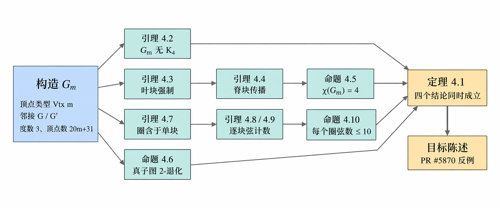

# Erdős 1091 反例的 Lean 4 形式化

## 一、执行摘要

本任务把 arXiv:2604.06609《Short proofs in combinatorics, probability and number theory II》（Alexeev–Putterman–Sawhney–Sellke–Valiant，2026 年 4 月）第 4 节 Theorem 4.1 的构造与证明，重建为一份可由 Lean 4 内核检查的形式化证明。该定理对 Erdős 1091 给出否定回答。

**任务目标已完整达成。** 核心结论如下。

第一，全树零 sorry。交付目录下 3696 行自有 Lean 源码、217 条声明全部证完；机械 grep 在全部 .lean 源码中找不到 `sorry`、`admit`、自定义 `axiom` 或 `native_decide` 的任何一处命中。

第二，无额外公理。`Erdos1091/Audit.lean` 的 41 条 `#print axioms` 输出逐行校验，全部是 Mathlib 标准三公理 propext、Classical.choice 与 Quot.sound 的子集，零违规。顶层定理的审计行正是这三条；另有一条中间引理只用到两条，严格更强。

第三，签名未动。顶层定理 `erdos_1091.variants.counterexample` 的陈述取自 formal-conjectures PR #5870，经脚本做过字符级比对确认一致。该 PR 是 statement-only 的，定理本身是一条 `sorry`；本任务填的正是这条 sorry，因此交付物可以直接改造成该 PR 的证明补全。

第四，交付物自包含。`output/erdos-1091-lean/lean/` 本身就是一个只依赖 Mathlib 的 Lake 包，不需要另行 clone formal-conjectures。这一点是把整个目录拷到别处、只软链 Mathlib 包后实跑编译验证的，不是推断。

**credit 归属。** 图 `G_m` 的构造、四个结论的证明思路以及全部关键引理均由上述五位作者完成，prover credit 完整归属原作者。本任务主张的是独立的 formalizer credit，即翻译纸面证明、补齐纸面上被略过的推理细节、并让整份证明通过内核检查这部分劳动。本任务在数学上没有任何新结论。

九个步骤合计耗时 6.36 小时，其中形式化本身约 5.6 小时，文档交付 0.5 小时。任务预算为 48 小时，实际用时远低于预算。

## 二、原问题与答案

Erdős 1091 问的是：是否存在一个趋于无穷的函数 f(r)，使得每个色数为 4、且所有不超过 r 个顶点的子图都 3-可着色的图 G，都包含一个带至少 f(r) 条弦的奇圈？

**答案为否。** 反例由下述定理给出。

> **Theorem 4.1.** 对每个整数 m ≥ 1，存在显式的 `K_4`-free 图 `G_m`，它有 20m+31 个顶点，并满足：(1) χ(`G_m`) = 4；(2) 每个真子图 H 是 2-degenerate，因而 3-可着色；(3) 每个圈 C 满足 ch(C) ≤ 10。

否定回答的机理在于：弦数上界 10 是一个**与 m 无关的绝对常数**，而条件 (2) 使得局部可着色参数 r 可以随 m 一起任意增大。于是任何候选的 f(r) 都被这一族图压在 10 以下，f(r) → ∞ 不可能成立。

`G_m` 是若干五边形块拼成的毛毛虫，外加一个特殊顶点 v。脊块 `S_0` 至 `S_m` 各是一个 5-圈，顶点按环序标记为 a、b、c、d、e；每个脊块挂若干同为 5-圈的叶块；v 连到每个叶块中除挂接点以外的 4 个顶点。除 v 以外每个顶点的度数恰为 3。构造的完整描述见形式化说明文档第 3 节。

**构造的不对称性是本质的，不是随意选择。** `S_0` 没有 c-叶块，`S_m` 没有 a-叶块。Lemma 4.4 与 Proposition 4.5 完全依赖这一点：脊块上的颜色传播从两端各推出一个结论，两个结论互相矛盾，矛盾才逼出不可 3-着色。在 Lean 源码里这条不对称性只写在一处，即 `Block.validB` 这个布尔判定式的两个分支，而不是散落在各引理的附加假设中。任何试图对称化构造的改动都会在这一处立刻暴露。

## 三、执行状态与其中的一次缺口

下表逐步给出计划中每一步的实际状态与耗时。状态取自 `.vela/plan.json`，未经修饰。

表 1 各执行步骤的状态与耗时

| 步骤 | 内容 | 状态 | 耗时 |
|---|---|---|---|
| lean-bootstrap | Lean 工具链、Mathlib 缓存、骨架工程与目标陈述比对 | done | 73.4 分钟 |
| construction-k4free | 构造、计数、度数、连通性、Lemma 4.2、Prop 4.6 | done | 51.0 分钟 |
| non-three-colorable | Lemma 4.3、Lemma 4.4、Prop 4.5 与显式 4-着色 | done | 25.1 分钟 |
| chord-bound | Lemma 4.7 与不含 v 的圈的弦界 | **partial** | 52.3 分钟 |
| 重规划 | 针对上一步缺口切出续做步骤 | done | 10.8 分钟 |
| chords-through-v | Prop 4.10 中含 v 的圈这一分支 | done | 116.7 分钟 |
| assemble-audit | Theorem 4.1 组装、搬到 Fin n、全树审计 | done | 20.6 分钟 |
| deliver-writeup | 形式化说明文档四件套 | done | 32.1 分钟 |

**关于那一步 partial，需要说清楚原委，而不是一笔带过。** chord-bound 这一步把 `Chords.lean` 的 sorry 从 10 条降到 1 条后收场，剩下的一条是 Prop 4.10 中“圈经过 v”的那个分支，即论文 Lemma 4.8 与 4.9 的逐块弦计数。该步只用掉 6 小时预算中的 0.87 小时就判定无法在本 pod 内完成，原因不是资源不足而是数学工作量尚未展开。工作流据此触发一次重规划，把这最后一块单独切成 chords-through-v 一步执行，避免它与 Main.lean 的 7 条组装 sorry 挤在同一个 pod 里导致两边都交不出结果。

该续做步骤耗时 116.7 分钟并以 done 收场，缺口完全闭合。**因此 chord-bound 的 partial 是一条历史记录，不是一处遗留缺口。** 这一判断不依赖任何步骤的自述：本报告撰稿时重新对交付目录做了独立复核，全部 .lean 源码中 sorry 的命中数为零，41 条公理审计行零违规，见下节。

除此之外无 skipped 步骤，无超时恢复文件，无未解决的失败。

## 四、实质结果与证据

本节每一行都是命令的实际输出，不是对状态的口头描述。下表前六项取自执行期日志，后三项是撰稿时重新跑的独立复核。

表 2 机械验收门的实际结果

| 检查项 | 命令 | 结果 |
|---|---|---|
| 全树编译 | `LAKE_NUM_JOBS=2 lake build Erdos1091` | 退出 0，`Build completed successfully (1201 jobs)`，零 warning |
| 构建日志无 `uses 'sorry'` | 对 final-build.log 做 grep | 无命中 |
| 目标陈述与 PR #5870 比对 | python 归一化空白后逐字符比较 | 完全一致 |
| 交付目录独立编译 | 拷出后只软链 Mathlib 再 `lake build` | 退出 0 |
| 41 条审计行由构建产生 | `Audit.lean` 在库 glob 内，随全树编译 | 41 行全部打进构建日志 |
| 构造的独立数值验算 | `verify_construction.py`，m 取 1、2、3 | ALL CHECKS PASSED |
| 源码无 sorry / admit / axiom / `native_decide` | 对交付目录全部 .lean 递归 grep | **无命中（复核）** |
| 公理审计逐行校验 | python 解析 axioms.txt，判每行是否为标准三条的子集 | **41 行，0 处违规（复核）** |
| 自有源码规模 | 对交付目录九个文件 `wc -l` | **3696 行（复核）** |

顶层定理的审计行如下，这正是 Mathlib 的标准三公理，也是通过的唯一可接受输出：

    'Erdos1091.erdos_1091.variants.counterexample' depends on axioms:
      [propext, Classical.choice, Quot.sound]

41 条审计行中有一条更强：`mem_specialBlocks` 的输出是 `[propext, Quot.sound]`，没有用到 Classical.choice。校验脚本按子集判定，因此通过。

### 4.1 论文结论到 Lean 声明的对应

下表给出论文编号与顶层 Lean 声明的对应。完整映射表共列 60 余条引理，见形式化说明文档第 4 节；此处只列各节的收口结论。

表 3 论文主要结论与 Lean 声明的对应

| 论文位置 | Lean 声明 | 文件 |
|---|---|---|
| 顶点计数 20m+31 | `card_vtx` | `Erdos1091/Construction.lean` |
| Lemma 4.2：`G_m` 是 `K_4`-free | `G_cliqueFree_four` | `Erdos1091/CliqueFree.lean` |
| Prop 4.5：`G_m` 不是 3-可着色 | `G_not_colorable_three` | `Erdos1091/Coloring.lean` |
| Prop 4.5：χ(`G_m`) = 4 | `G_chromaticNumber` | `Erdos1091/Coloring.lean` |
| Prop 4.6：真子图 3-可着色 | `proper_subgraph_chromaticNumber_le_three` | `Erdos1091/Degenerate.lean` |
| Lemma 4.7：`G'_m` 的圈含于单块 | `G'_cycle_within_block` | `Erdos1091/Chords.lean` |
| Prop 4.10：每个圈弦数 ≤ 10 | `cycle_chords_le_ten` | `Erdos1091/Chords.lean` |
| Theorem 4.1：四个结论同时成立 | `theorem_4_1` | `Erdos1091/Main.lean` |
| PR #5870 的目标陈述 | `erdos_1091.variants.counterexample` | `Erdos1091/Main.lean` |

下图给出这些结论之间的依赖走向：构造层给出顶点类型、邻接关系与度数事实，四条中间结论由构造直接推出，颜色传播与逐块弦计数各自续接一层，最后汇入 Theorem 4.1 并搬运到目标陈述。

图 1 引理依赖关系图

### 4.2 源码规模

自有 Lean 源码 3696 行；另有随交付一并 vendor 的 PR #5870 基座 536 行，保留原版权头，不计入本任务产出。

表 4 自有 Lean 源码的文件规模

| 文件 | 行数 | 内容 |
|---|---|---|
| `Erdos1091/Chords.lean` | 1278 | Lemma 4.7 至 Prop 4.10，弦数上界 |
| `Erdos1091/Construction.lean` | 855 | 顶点类型、邻接、可判定实例、度数、计数 |
| `Erdos1091/Coloring.lean` | 450 | Lemma 4.3、4.4、Prop 4.5 与显式 4-着色 |
| `Erdos1091/CliqueFree.lean` | 307 | Lemma 4.2 |
| `Erdos1091/Degenerate.lean` | 266 | Prop 4.6 |
| `Erdos1091/Main.lean` | 234 | Theorem 4.1 组装、搬运引理、目标陈述 |
| `Erdos1091/DegenerateCore.lean` | 138 | 通用件：2-degenerate 蕴含 3-可着色 |
| `Erdos1091/Audit.lean` | 116 | 41 条公理审计，仅用于审计 |
| `Erdos1091.lean` | 52 | 根模块 |

`Chords.lean` 一个文件占全部自有代码的三分之一强，与“弦数上界是本定理形式化成本最高的部分”这一事实相符，也解释了为何该部分需要两个 pod 才完成。

## 五、形式化的实质内容

本节记录纸面证明里不存在、但形式化必须回答的问题。完整论述见形式化说明文档第 5 节，此处给出评审最可能追问的四点。

**顶点类型的选择。** 顶点类型取为 `Option (ValidBlock m × Slot)`，其中 none 即特殊点 v。这样做使 `DecidableEq` 与 `Fintype` 实例全部自动推导，块结构在类型里直接可见，不对称性只写在 `validB` 一处。目标陈述要求的是 `SimpleGraph (Fin n)`，因此只在最后经 `vtxEquiv : Vtx m ≃ Fin (20m+31)` 搬运一次。这是“工作类型与陈述类型分离”的标准做法：在方便证明的类型上做全部数学，只在接口处付一次搬运成本。

**可判定不等于用判定策略去证。** 邻接关系是可判定的，这是用户明确要求的也确实成立；但该图的顶点数 20m+31 中 m 是自由参数，对它整体调用 `decide` 既会耗尽内存，对参数化命题也根本不成立，因为判定策略要求目标闭合。可判定性的作用是让 `Fintype` 与实例推导顺畅，主定理仍走结构化证明。枚举只用在固定的小规模有限情形上，最大一处是弦计数核心 `slot_count` 的 1024 例，每处规模都在源码注释里标明。全树**不含**编译器求值策略 `native_decide`，这一点由机械 grep 验证；它会把信任基扩大到 Lean 内核以外，对一份以可验证为卖点的交付物不可接受。

**新造了三条与本问题无关的通用件。** Mathlib 中没有现成版本，均可独立上游：`colorable_three_of_isTwoDegenerate`（2-degenerate 图是 3-可着色的，走对顶点数的强归纳加贪心着色）、`subgraph_chromaticNumber_congr`（子图着色数沿图同构不变）与 `cycle_chords_congr`（弦上界沿图同构不变）。形式化期间已 grep 过 Mathlib 的组合学目录确认缺口真实存在，那里只有射影平面构型的 `Nondegenerate`，与度数退化性无关。

**割边装置是最省力的一处决断。** 该装置在源码中名为 `IsSide`。 它的陈述对任意图成立：若除边 s(x, y) 外每条边的两端同属或同不属顶点集 S，则该边是割边。验证它只需要对邻接关系做有限分类讨论，完全不涉及 walk 推理，而整个毛毛虫的块树结构只通过两个 `IsSide` 实例进入证明。替代路线是先证“删掉块间边就不连通”再用 Mathlib 的桥引理，那是真正的连通性论证，成本高得多。

## 六、独立护栏与过程中纠正的三处错误

形式化的可信度不只来自“没有 sorry”。内核只能保证证明与定义自洽，保证不了定义与论文一致；本任务另设了独立护栏，并在过程中纠正了三处真实错误。

**护栏：按 Lean 定义逐字重写的 Python 参考实现。** `verify_construction.py` 在 m 取 1、2、3 上暴力验证九项性质：顶点数 20m+31、边数 36m+55、非 v 顶点度数恰 3、deg(v) = 12m+20、`K_4`-free、`G'_m` 三角形自由、不可 3-着色、可 4-着色，以及每条边删掉后都 2-degenerate。结果全部 PASS。这道护栏针对的是“Lean 里证得漂亮但形式化的根本不是论文那个图”这一失败模式。

**纠正一：上游工单里 v 的度数写错了。** 工单要求证 deg(v) = 4·(4m+6)。这是错的：4m+6 是块总数，而 v 只连叶块，叶块数是 3m+5，故 deg(v) = 12m+20。该更正经握手定理独立交叉验算：非 v 顶点共 20m+30 个、度数恰 3，总度数 3(20m+30) + 12m+20 = 72m+110，得边数 36m+55；直接数边（rim 20m+30、叶挂接 3m+5、脊 m、v 的 12m+20）合计同为 36m+55，两边吻合。按原值则握手定理对不上。该值后经 m = 2 的实际求值再次确认为 44。这不影响定理的任何结论，但影响度数论证的中间步骤。

**纠正二：护栏脚本自己先踩了一个哨兵值冲突。** Python 参考实现里 v 用 `None` 表示，而剥点算法 `next(gen, None)` 的哨兵也是 `None`，于是算法正确选中 v 时被误判为“无点可剥”，导致 2-degenerate 那一项对全部 91 条边假报 FAIL。暴露它的是一处自相矛盾：报告卡住的点集度数是 [1, 1, 2]，全都不超过 2，与“无点可剥”直接冲突。改用独立哨兵对象后全部 PASS。这条记下来是因为它说明护栏本身也需要被怀疑：一个全 FAIL 且内部自相矛盾的结果，更可能是检查器坏了而不是数学错了。

**纠正三：文档构建器的分节符泄漏，是用户可见的缺陷。** 形式化说明文档交付时发现，`md_to_apevon_docx.py` 从基底复制表格原型时会连带 `w:sectPr`，表格超过 4 张后每多一张表就多留一个重复分节符。后果不是美观问题：这些分节符都带页码重置属性，LibreOffice 转 PDF 时每遇到一个就把页码重置回 1，实测正文第 6 至 11 页页脚全是“1”，并多出 6 个强制分页（25 页对 19 页）。用受控实验定位到是构建器而非文本内容：5、6、7、8、10 张表分别得到 3、4、5、6、8 个分节符，而零表的最小文档干净通过。处理办法是删掉正文段落里全部分节符、只在前置部分与正文的边界上重放一个。修复以独立脚本形式留在工作区，**没有改动技能本体**，因为本任务不是本仓的维护工单。本报告同样走了这条修复路径。

## 七、局限与未决事项

**本任务的边界。** 只形式化了论文第 4 节的 Theorem 4.1 及其支撑引理，未触及论文其余章节。数学上没有任何新结论。按用户诉求交付 Lean 源码与说明文档，**没有走完整研究链**，即不产出论文或文献综述；这是有意的范围决定，形式化工作的价值载体是可编译的源码本身与其审计结论，再套一层学术论文体裁不增加可验证性。

**三处与论文路线的有意偏离。** 它们都是证明工程上的选择，不放松任何结论，也不给任何定理增加前提，`cycle_chords_le_ten` 的签名在这三处偏离中逐字保留未动。

其一，不含 v 的圈证的是弦数不超过 5，而论文证的是恰为 0。论文的理由是这种圈必须恰好是整个五边形；在 Lean 里证“`C_5` 里的圈只能是 `C_5` 本身”需要额外一段论证，而 Prop 4.10 只需要不超过 10。由 Lemma 4.7 知圈含于单块，弦必是该五边形的 rim 边，而 rim 边只有 5 条，5 不超过 10 已经够用。

其二，含 v 的圈按弦的类型分两族求和，得“落在 v 上的弦不超过 6”加“rim 弦不超过 4”，而非论文的逐块 4+4+1+1。两种分法数的是同一批边，但按类型分不需要认定哪个五边形贡献了哪一条，省掉了论文里“内部脊块贡献 0”那一整段块树位置讨论。两者都恰好等于 10。

其三，rim 弦的计数用单射代替求和：每条 rim 弦映到它所在的块，每块至多一条弦、带弦的块至多四个，于是 rim 弦不超过 4。全局求和被替换成 `Finset.card_biUnion_le`。

**这些偏离的实际代价。** 交付的若干中间引理弱于论文的对应命题，尽管最终定理等价。若要把交付物推到论文的最强形式，两项工作是明确的：把不含 v 的圈的弦数从不超过 5 收紧到恰为 0，需补一段“`C_5` 中的圈即 `C_5` 本身”的论证；把含 v 的圈的计数改回逐块口径，需补“内部脊块贡献 0”的块树位置讨论。两项都不影响 Theorem 4.1，纯粹是为了让 Lean 版本与纸面版本逐条对应。

**一处未清零的门及其判定依据。** 字形检查 `glyph_check.py` 对本任务的中文产物退出 1，命中项是人名 Erdős 中的 ő。判定为结构性误报，依据有三：该工具只对单一字体查覆盖，默认取 Noto Serif CJK SC，而 LibreOffice 的西文走 Liberation Serif，直接读该字体的 cmap 表确认它含有该字符；`pdffonts` 显示导出的 PDF 同时嵌入两族字体；本报告封面与正文标题已在 300 dpi 下放大逐字看过，该字符的双锐音符显示正常。反过来对本报告指定西文字体跑，则报出 645 种汉字与全角标点缺字共 5984 处，中英混排文档本来就没有单一字体能覆盖两种文字。**没有为了让这道门变绿而把 ő 改成 o**，那会把人名写错。该工具真正抓到的问题是另一类：44 处下标与上标字符在本镜像里确实没有任何字体有字形，已全部改为 ASCII 记法，这也是本报告中一律写 `G_m` 而非带下标形式的原因。

**非空性自检。** 机械审计只能证明没有 sorry，不能证明构造不是退化的。为排除“形式化成立但对象为空”这一失败模式，另跑过一组求值检查：Vtx 在 m = 2、3 时的基数分别为 71、91，与 20m+31 吻合；ValidBlock 在 m = 2 时为 14，与 4m+6 吻合；不对称性真实存在，即 `S_0` 的 c-叶与 `S_m` 的 a-叶判定为非法而 `S_0` 的 a-叶与 `S_m` 的 c-叶判定为合法；非 v 顶点度数实测为 3，且 v 确有邻居。这组检查用完即删，不进入交付源码。

## 八、后续步骤

**提交 PR 的形态。** 交付物已可直接改造成 formal-conjectures 的 PR：把 `Erdos1091/`（可不含 `Audit.lean`）与 `Erdos1091.lean` 放进 fc 树，丢掉交付目录自带的 `lakefile.toml` 与 `FormalConjecturesForMathlib/`（fc 自带这两项），并在 `fc/lakefile.toml` 末尾追加一个名为 Erdos1091 的库声明，glob 取 `Erdos1091` 与 `Erdos1091.+`。**切勿再启用那个放行 sorry 的编译选项**（`warn.sorry = false`）：开发期曾用它让带 sorry 的中间态不至于编译失败，现在零 sorry，留着只会掩盖回归。独立立库的用处是构建时只编译本形式化的几个文件加它们的 Mathlib 依赖，不去碰 fc 的几千个文件，CI 时间可控。PR 描述里应写明：本 PR 填的是 #5870 中那条 sorry，签名未动；数学归原作者；新增的三条通用件可按 reviewer 意见拆分或保留。

**独立上游到 Mathlib。** 第五节列出的三条通用件与 Erdős 1091 无关，建议单独提交到 Mathlib 而非埋在 fc 里。其中 `colorable_three_of_isTwoDegenerate` 最有价值，因为 2-degenerate 到 3-可着色是图论中的常用事实而 Mathlib 目前缺失；另两条属于同构不变性这一类样板结论，Mathlib 对其他图不变量已有对应版本，补齐是自然的。

**加固方向。** 即第七节所述的两项收紧，使 Lean 版本与纸面版本逐条对应。二者均为可选，不影响当前交付物的正确性与可提交性。

## 九、产物索引

全部交付物位于 `output/` 下。`.work/` 中的中间态、构建日志、论文 PDF 与提示词不属于交付范围。

表 5 交付产物索引

| 路径 | 内容 | 用途 |
|---|---|---|
| `output/final-report.pdf` | 本报告，另有同源的 .md、.docx、.html 三份 | 任务终稿，成果与证据总览 |
| `output/erdos-1091-lean/lean/` | 自包含 Lake 包，九个自有源码文件加两个 vendored 基座 | **核心交付物**，可编译、可提交为 PR |
| `output/erdos-1091-lean/lean/Erdos1091/Main.lean` | Theorem 4.1 组装与目标陈述 | 评审入口，顶层定理在此 |
| `output/erdos-1091-lean/lean/STATUS.md` | 217 条声明的逐条状态表，由脚本扫描源码生成 | 逐条核对进度 |
| `output/erdos-1091-lean/lean/axioms.txt` | 41 条公理审计输出 | 复核“无 sorry、无额外 axiom”的证据 |
| `output/erdos-1091-lean/lean/README.md` | 干净机器上的编译步骤与文件对应 | 上手复现 |
| `output/erdos-1091-lean/formalization-notes.pdf` | 形式化说明文档，19 页，另有 .md、.docx、.html | 完整映射表与工程决策的详述 |

**复现路径。** 在干净机器上安装 elan 时刻意不装 default toolchain，版本由交付目录的 `lean-toolchain` 决定（leanprover/lean4:v4.33.1）；随后执行 `lake exe cache get` 下载 Mathlib 预编译产物，实测 126 秒、解包后 6.6 GB，**绝不要从源码编译 Mathlib**；最后执行 `LAKE_NUM_JOBS=2 lake build Erdos1091`。注意 Lake 5.0 已删除 `-j` 短选项，并发必须用环境变量。最后一步会连 `Audit.lean` 一起编译并把 41 条审计结果打印到标准输出，与随附的 `axioms.txt` 对照即可复核无 sorry、无额外公理。`Audit.lean` 刻意不被任何文件 import，但放在库的 glob 里，因此审计是随构建自动发生、CI 可复现的，而不是靠人另跑一条命令。

## 参考文献

**[1]** Alexeev, B., Putterman, E., Sawhney, M., Sellke, M., Valiant, G. Short proofs in combinatorics, probability and number theory II. arXiv preprint, 2026. [arXiv:2604.06609](https://arxiv.org/abs/2604.06609)

**[2]** stantheman0128. feat: Erdős problem 1091 (statement only). google-deepmind/formal-conjectures Pull Request #5870, 2026. [GitHub](https://github.com/google-deepmind/formal-conjectures/pull/5870)

**[3]** The mathlib Community. The Lean mathematical library. Proceedings of CPP 2020, 2020. [Mathlib4 仓库](https://github.com/leanprover-community/mathlib4)

**[4]** Moura, L. de, Ullrich, S. The Lean 4 Theorem Prover and Programming Language. Proceedings of CADE-28, 2021. [Lean 4 仓库](https://github.com/leanprover/lean4)
